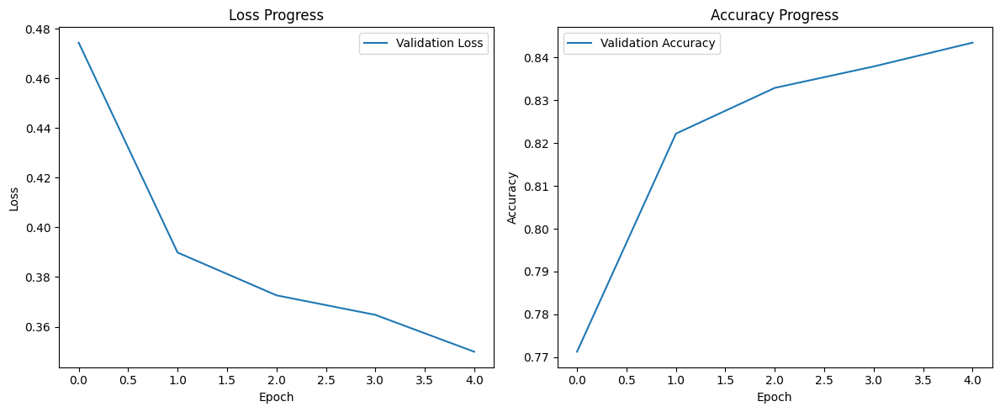

# 🎮 IMDB Sentiment Analysis with Transformers


🚀 This project performs **sentiment analysis on IMDB movie reviews** using a **custom Transformer model** built with PyTorch. The model classifies reviews as **Positive** or **Negative**.

## **✨ Features**
✅ **Custom Transformer model** for sentiment classification  
✅ **Trained on IMDB dataset** using PyTorch  
✅ **Hosted on Streamlit Cloud** for easy access  
✅ **Automatically downloads the model from Kaggle**  

## **📈 Training Performance**


---

## **📌 Demo**
🔗 **[Live Web App](https://imdb-sentiment-analysis-with-transformers-ilmannbgvqmmyqt9z284.streamlit.app/)**  

> Enter an IMDB movie review and get an instant sentiment prediction!  

---

## **🛠 Installation & Setup**
### **1️⃣ Clone the Repository**
```sh
git clone https://github.com/your-username/imdb-sentiment-analysis.git
cd imdb-sentiment-analysis
```

### **2️⃣ Install Dependencies**
```sh
pip install -r requirements.txt
```

### **3️⃣ Set Up Kaggle API**
Since the model is stored on Kaggle, you must set up the Kaggle API:  
- Go to [Kaggle](https://www.kaggle.com/).
- Click on your **profile** → **Account**.
- Scroll to **API** → Click **"Create New API Token"**.
- Move the downloaded `kaggle.json` to:
  - **Linux/macOS**: `~/.kaggle/kaggle.json`
  - **Windows**: `C:\Users\YourUser\.kaggle\kaggle.json`

### **4️⃣ Run the Streamlit App**
```sh
streamlit run app.py
```
The app will automatically **download the model from Kaggle**, load it, and provide a UI for predictions.

---

## **📚 Project Structure**
```
📚 imdb-sentiment-analysis
│-- 📚 src
│   ├─ dataset.py            # IMDB dataset processing
│   ├─ inference.py          # Prediction function
│   ├─ model.py              # Transformer model architecture
│   ├─ train.py              # Training script
│   ├─ validate.py           # Model validation
│   ├─ utils.py              # Helper functions
│   ├─ lr_scheduler.py       # Learning rate scheduler
│   ├─ visualize.py          # Training visualization
│-- 📚 models
│   ├─ checkpoint_3.pth      # Trained model (auto-downloaded from Kaggle)
│-- app.py                    # Streamlit web app
│-- requirements.txt           # Dependencies
│-- README.md                  # Project documentation
```

---

## **⚡ Model Details**
- **Architecture:** Custom Transformer-based model built from scratch in torch
- **Tokenizer:** `bert-base-uncased` from Hugging Face  
- **Dataset:** IMDB reviews dataset  
- **Training:** Optimized using a learning rate scheduler  
- **Accuracy:** Achieved **high accuracy** on test data  

---

## **📌 How It Works**
1️⃣ **User enters a movie review** in the Streamlit app  
2️⃣ **The app tokenizes the text** using `bert-base-uncased`  
3️⃣ **The Transformer model predicts** whether the review is **Positive** or **Negative**  
4️⃣ **The result is displayed in the UI**  

---

## **🚀 Deployment on Streamlit Cloud**
1. **Push your project to GitHub**  
2. **Go to** [Streamlit Cloud](https://streamlit.io/cloud)  
3. **Deploy the repo** and add Kaggle API credentials under **Secrets**  
4. **Your app is live! 🎉**  

---

## **📞 Contact**
💬 **Author:** [Your Name](https://github.com/yusufshihata)  
📧 **Email:** yusufshihata2006@gmail.com  
```